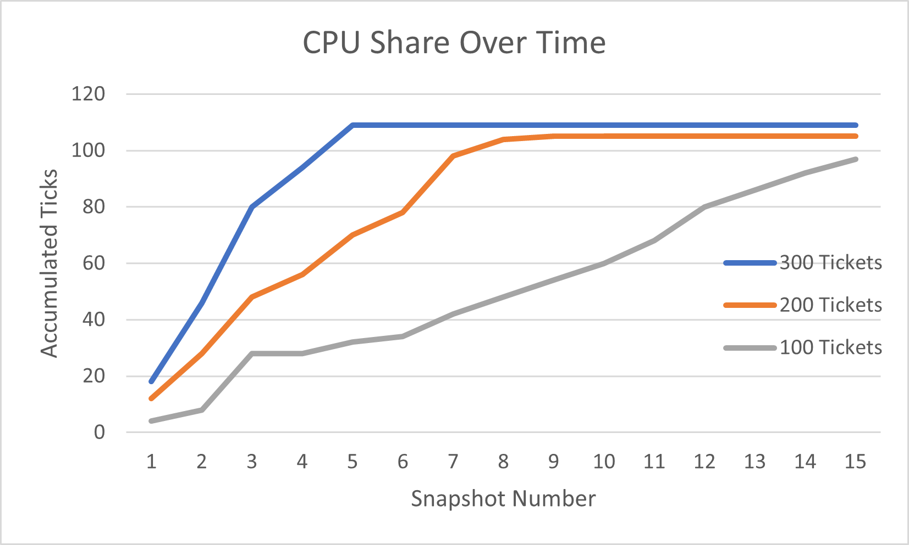
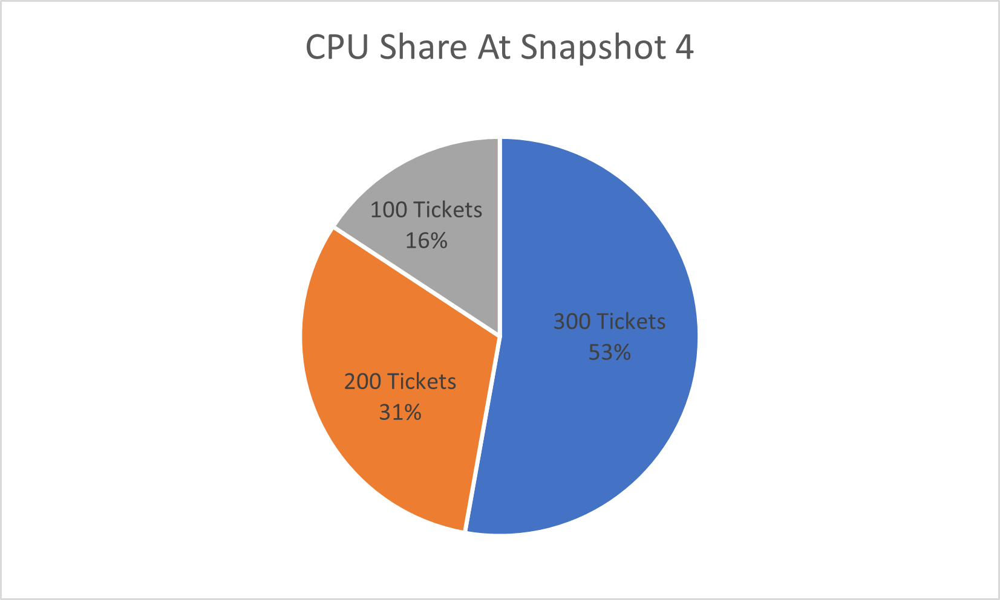

# Project 5: Scheduling
### Meg Jaffy | CS 372 - 01 | October 2, 2020

To test my implementation of lottery scheduling, I created a user program called lotteryTesting, which can be called from the shell using `$ lotteryTesting n` where `n` is approximately one tenth of the number of cycles each process will use. This creates 4 processes, three that will do pointless work and one that will occasionally check in on the other three using the system call `getpinfo`. The working cycles have 100, 200, and 300 tickets respectively. The following graphs (generated based on running lotteryTesting with n=20,000,000) show that the processes run in proportion to each other based on their tickets at different snapshots. Note that while I took 20 snapshots, I'm only using the first 15 because the working processes end after that.

 In this image, you can see that the process with 300 tickets has always accumulated
 more ticks than the process with 200 tickets than the one with 100 tickets. Also
 note that the 300 ticket process finishes around snapshot 5 (and then waits for its child to finish), and the 200 ticket process finishes around snapshot 8 (and then waits for its child).

 It's helpful to zoom in on the proportions just before the 300 ticket process goes into a wait (at snapshot 4):

 

 Here, we can see that the proportion between a 100 ticket process and a 300 ticket process is `53/16 = 3.3`, which is just slightly over the `300/100 = 3` ratio predicted. Comparing the 300 ticket process with the 200 ticket process we see a ratio of `53/31 = 1.7` which is just over the `300/200 = 1.5` ratio predicted, and finally `31/16 = 1.9` which is almost exactly the `200/100 = 2` ratio predicted. So overall these ratios are very close to the ratios we predicted, and the line chart demonstrates the consistency of these ratios, showing that the lottery scheduler implemented was effective. 
